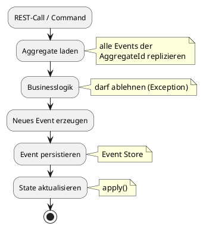
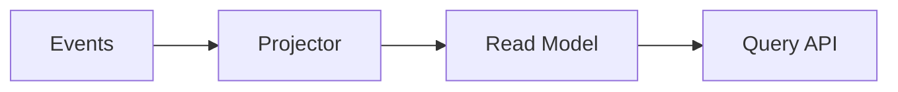

---
# try also 'default' to start simple
theme: default
# random image from a curated Unsplash collection by Anthony
# like them? see https://unsplash.com/collections/94734566/slidev
background: ./img/Gemini_Generated_Image_emqxavemqxavemqx.png
# some information about your slides (markdown enabled)
title: Event Sourcing
class: text-center
# https://sli.dev/features/drawing
drawings:
  persist: false
# slide transition: https://sli.dev/guide/animations.html#slide-transitions
transition: slide-left
# enable Comark Syntax: https://comark.dev/syntax/markdown
comark: true
# duration of the presentation
duration: 35min
---

# Event  Sourcing

## Timo Scheffler

### SDC 2026

<!--
Zu mir:
- NWR
- opendata
- datahub

Vorträge:
- Blumengießen
- Lagerhaltung
-->

---
layout: two-cols
title: Motivation
---

# CRUD
`UPDATE accounts SET balance = 120`

- speichert IST-Zustand
- direkt abfragbar, einfach zu verstehen
- weiß nicht, was vorher war.
- braucht Migrationen, hat destruktive Operationen

::right::

# Event Sourcing
`AccountOpened, MoneyDeposited, ...`

- speichert den **Weg** zum IST-Zustand
- Auswertungen ⇨ Projection
- hat integrierte Historie (Audit-Log)
- keine destruktiven Operationen 🤩

<!--

Historie:

- Debugging einfacher -> Anstatt Logs gucken einfach Events auflisten

Destruktion:

- Kein **Datenverlust** durch Fehler in Migration auf Produktivdaten.

-->

---
title: ES Beispiel
---

# Events

| # | Event | Payload |
|---| ----- | ------- |
| 0 | AccountOpened   | \{ initialBalance: 0 \}    |
| 1 | MoneyDeposited |  \{ amount: 100 \}         |
| 2 | MoneyDeposited  | \{ amount: 50 \}          |
| 3 | MoneyWithdrawn  | \{ amount: 30 \}          |

State nach dem Anwenden aller Events: `balance = 120`

*Ein bisschen wie git commits...*

---
layout: two-cols
---

# Aggregate

::left::

- Konsistenzgrenze in der Domäne
- hat AggregateId
- Enthält Businesslogik
- wird nur über das `apply()` von Events verändert

## Mechanismen

- Optimistic Locking für Events (wie JPA mit `version`)
- Bei Race-Condition ⇨ Retry

::right::

<!--

Version: Die Version des Aggregates nach Anwenden des Events.

-->

---

# Demoprojekt

---
layout: center
class: text-center
---

# 🚀 Demo - Basics
Events und State

<!--

### 4a. Event Sourcing zeigen → `bank-account.http`
1. Requests der Reihe nach ausführen, **wichtige Responses erklären**:
   - Request 1 (POST /accounts): Response-Body ist eine UUID – die AggregateId
   - Request 3–5 (deposit/withdraw): neue Balance direkt in der Response
   - Request 7 (Überziehung): sprechende Fehlermeldung, HTTP 422
   - Request 8 (GET nach Fehler): Balance noch 120 € – kein Event, kein Schaden
2. Nach dem Durchlauf: **`domain_events`-Tabelle in pgAdmin zeigen**
   - Jede Zeile = ein Event
   - Payload: nur das fachliche Delta
   - version: aufsteigend pro AggregateId
   - occurred_at: Zeitstempel für Zeitreise-Queries

-->

---

# Projektion

"Und wenn ich komplizierte Abfragen habe?"

- Aktueller IST-Zustand z.B. in relationaler Datenbank ⇨ SQL-Abfragen möglich
- Eventually consistent, kleine Verzögerung, für Anzeigezwecke egal
- CQRS (anderes Model für Schreiboperationen als für Leseoperationen)
- ⚠️ Um *Änderungen* vorzunehmen wird **immer** der Zustand aus dem Event Store geladen und neue Events gespeichert (in einer Transaktion)
- Fun Fact: Der berechnete State im Aggregate ist **die wichtigste Projektion**

<!--

CQRS:
Hier: Pragmatischer Kompromiss, gebe den State des aktualisierten Aggregate nach dem Command zurück

Eigentlich geben Commands nichts zurück.

Synchrone Projektion -> Verlangsamt die Event-Verarbeitung, ggf. failed alles bei kaputtem Projektor.

-->

---
layout: "center"
class: text-center
---

# 📽️ Demo - Projektion
Read Model und Abfragen

<!--
### 4c. Projektion zeigen → `statistics.http`
1. Zwei Konten anlegen, unterschiedliche Beträge einzahlen
2. `GET /statistics/accounts/above-balance?threshold=100` ausführen
3. **`bank_account_read_model`-Tabelle in pgAdmin zeigen** – normale
   SQL-Tabelle, normale Abfragen möglich ✅
4. Beide Tabellen nebeneinander: Event Store vs. Read Model –
   zwei verschiedene Sichten auf dieselbe Wahrheit
-->

---

# Replay
Jetzt ernten wir die Früchte...

- Read Models können jederzeit weggeworfen und neu berechnet werden
  - Bug im Projektor gefunden? ⇨ Update der Software ⇨ Replay
  - Neues Read Model für neuen Use-Case ⇨ Replay
  - Schema Änderung (Refactoring?) im Read Model ⇨ Replay
- **Keine Live-Daten** migrieren in der Produktionsumgebung 😍

---
layout: center
class: text-center
---

# 💫 Demo - Replay
It's Magic!

<!--
### 4e. Replay zeigen → `replay.http`
1. Requests 1–5 ausführen: Daten anlegen, Statistik prüfen
2. **Beide Tabellen nebeneinander in pgAdmin anordnen** (domain_events links,
   bank_account_read_model rechts)
3. Request 6 ausführen: `DELETE /admin/read-model`
   - Rechte Tabelle: leer ← sichtbar in pgAdmin
   - Linke Tabelle: unverändert ← der Event Store ist unangetastet
4. Request 7 ausführen: Statistik-Abfrage → leeres Array `[]`
5. Request 8 ausführen: `POST /admin/read-model/replay`
   - Response zeigt Anzahl replizierter Events
6. Request 9 ausführen: Statistik-Abfrage → Ergebnis ist wieder korrekt ✅
   - Rechte Tabelle: wieder befüllt – live in pgAdmin sichtbar
-->

---

# Noch mehr...

- Zustand eines Aggregates zum Zeitpunkt X?  
  ⇨ Diagramm malen über die Saldoentwicklung des Kontos.
- Heal-Events bei Fehlern in alten Events

---

# Microservices?

## TODO!

---

# Kafka?

Hat auch append-only, müsste sich doch total gut eignen?

--> Lesen aller Events zu einem Aggregate geht nicht, man bekommt immer den ganzen Strom
--> hat Compaction, die wir nicht brauchen, also würde sowieso viel verloren gehen

Eher nein.

---
layout: end
title: Ende
---

Dankeschön!
