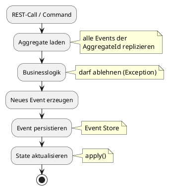
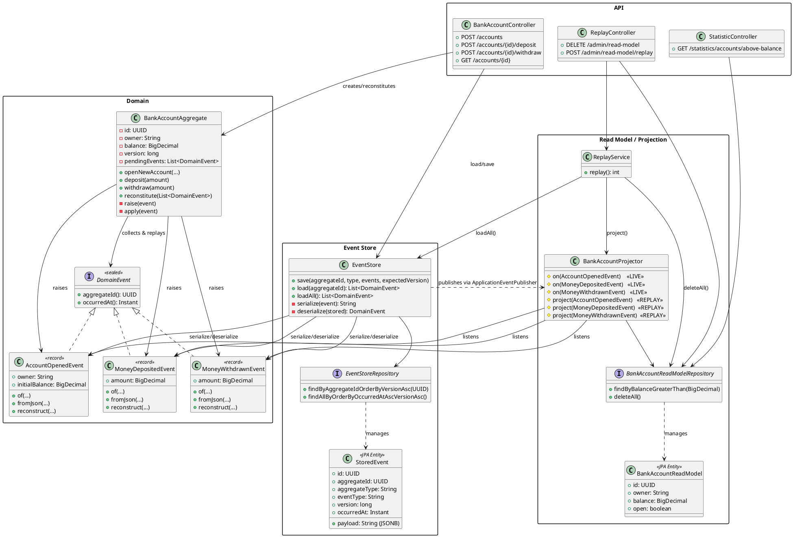
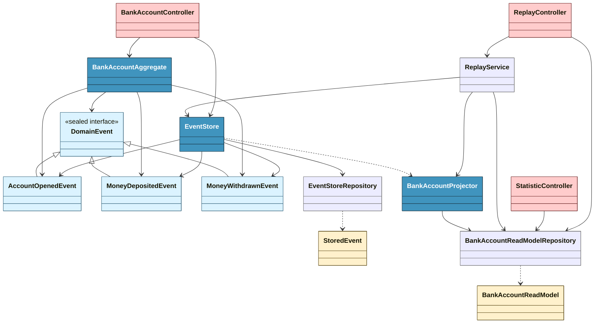
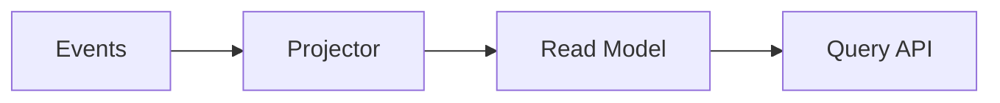

---
# try also 'default' to start simple
theme: default
# random image from a curated Unsplash collection by Anthony
# like them? see https://unsplash.com/collections/94734566/slidev
background: /img/Gemini_Generated_Image_emqxavemqxavemqx.png
# some information about your slides (markdown enabled)
title: Event Sourcing
class: text-center
# https://sli.dev/features/drawing
drawings:
  persist: false
# slide transition: https://sli.dev/guide/animations.html#slide-transitions
transition: slide-left
# enable Comark Syntax: https://comark.dev/syntax/markdown
comark: true
# duration of the presentation
duration: 40min
---

# Event  Sourcing

## Timo Scheffler

### SDC 2026

<!--
Vorträge:
- Blumengießen -> mehr als 4 Blumen, abgeschaltet
- Lagerhaltung -> mittlerweile Grocy

Zu mir:
- NWR
- opendata
- datahub

datahub: grüne Wiese! Aber trotzdem Chance verpasst, weil keine Erfahrung und Zeitdruck.
-->

---
layout: two-cols-header
layoutClass: gap-x-16
---

# Motivation 

> Was war der Kontostand von Kunde X am 3. März um 14:32 Uhr?

&nbsp;

::left::

# CRUD
`UPDATE accounts SET balance = 120`

- speichert IST-Zustand
- direkt abfragbar, einfach zu verstehen
- überschreibt immer den vorigen Zustand
- braucht Migrationen, hat destruktive Operationen

::right::

# Event Sourcing
`AccountOpened, MoneyDeposited, ...`

- speichert den **Weg** zum IST-Zustand
- hat integrierte Historie (Audit-Log)
- Auswertungen ⇨ Projection
- keine destruktiven Operationen 🤩

<!--
Destruktion bei CRUD:

- Kein **Datenverlust** durch Fehler in Migration auf Produktivdaten.

Historie:

- Debugging einfacher -> Anstatt Logs gucken einfach Events auflisten
-->

---
title: ES Beispiel
---

# Events
(für ein Aggregate)

| # | Event | Payload |
|---| ----- | ------- |
| 0 | AccountOpened   | \{ initialBalance: 0 \}    |
| 1 | MoneyDeposited |  \{ amount: 100 \}         |
| 2 | MoneyDeposited  | \{ amount: 50 \}          |
| 3 | MoneyWithdrawn  | \{ amount: 30 \}          |

State nach dem Anwenden aller Events: `balance = 120`

*Ein bisschen wie git commits...*

---
layout: two-cols
---

# Aggregate

::left::

- Konsistenzgrenze in der Domäne
- hat AggregateId
- Enthält Businesslogik
- wird nur über das Anwenden von Events auf den eigenen Zustand verändert

## Mechanismen

- Optimistic Locking für Events (wie JPA mit `version`)
- Bei Race-Condition ⇨ Retry

::right::

<!--
Einstieg: Was ist ein Aggregate? 

Beispiel-Command: Geld abheben
 - kann schiefgehen -> Exception

Version: Die Version des Aggregates nach Anwenden des Events.
-->

---
title: Demoprojekt komplex
---

  "Hey KI, erzeuge mir ein Klassendiagramm!"

---
title: Demoprojekt einfach
---

  "Hey KI, machs einfacher!"

---
layout: center
class: text-center
---

# 🚀 Demo - Basics
Events und State

<!--
### 4a. Event Sourcing zeigen → `bank-account.http`
1. Alle requests ausführen
   - mit withdraw einsteigen, durchgehen
-->

---

# Projektion

"Und wenn ich komplizierte Abfragen habe?"

- Aktueller IST-Zustand z.B. in relationaler Datenbank ⇨ SQL-Abfragen möglich

- Eventually consistent, kleine Verzögerung, für Anzeigezwecke egal

- CQRS (anderes Model für Schreiboperationen als für Leseoperationen)

- 😊 Fun Fact: Der berechnete State im Aggregate ist **die wichtigste Projektion**

- ⚠️ Um *Änderungen* vorzunehmen wird **immer** der Zustand aus dem Event Store geladen und neue Events gespeichert (in einer Transaktion)

<!--
CQRS (Command Query Responsibility Segregation):

Hier: Pragmatischer Kompromiss, gebe den State des aktualisierten Aggregate nach dem Command zurück

Eigentlich geben Commands nichts zurück.

Synchrone Projektion -> Verlangsamt die Event-Verarbeitung, ggf. failed alles bei kaputtem Projektor.
-->

---
layout: "center"
class: text-center
---

# 📽️ Demo - Projektion
Read Model und Abfragen

<!--
### 4c. Projektion zeigen → `statistics.http`
1. alles zur projektion zeigen
2. transaction-hook zeigen

Warum wird im Projector die Domain-Logik gedoppelt?
*Kann* man so machen - **oder** man lädt hier auch zum Event das Aggregate aus dem Event Store inkl. Event und speichert das.

ABER: Ist nicht für alle Projektionen nötig. GGF. interssiert uns hier nicht, ob ein Account open oder closed ist, optimierung durch Vereinfachen.
-->

---

# Replay
Jetzt ernten wir die Früchte...

Weil das Read Model nur eine Projektion ist:

- Read Models können jederzeit weggeworfen und neu berechnet werden

  - Bug im Projektor gefunden? ⇨ Update der Software ⇨ Replay

  - Neues Read Model für neuen Use-Case ⇨ Replay

  - Schema Änderung (Refactoring?) im Read Model ⇨ Replay

- **Keine Live-Daten** migrieren in der Produktionsumgebung 😍

---
layout: center
class: text-center
---

# 💫 Demo - Replay
It's magic!

<!--
### 4e. Replay zeigen → `replay.http`
1. Requests einzeln durchgehen, zwischendurch die Tabellen zeigen
-->

---

# Wir können noch mehr!

- "Zustand eines Aggregates zum Zeitpunkt X" herausfinden ermöglicht:
  - Saldoentwicklung über einen Zeitraum anzeigen
  - Temporale Abfragen (Kontostand zum Zeitpunkt X)
- Bei korrupten Daten durch alte Bugs: Heal-Events einfügen repariert und zeigt den Prozess
- Optimierung: Wenn sehr viele Events pro Aggregate existieren
  - Read Model für Snapshots aufbauen + nur Diff aus Events lesen

<!--

Healing: Neue Events einfügen, wenn man bei bestimmten Event-Konstellationen etwas fixen muss.

Mit Microservices: Benutze Outbox-Pattern

-->

---
layout: two-cols-header
layoutClass: gap-x-16
---

# Unterschiede in der Entwicklung
Wie fühlt sich die Entwicklung an?

::left::

## CRUD

- Denken in Zuständen, in Datenspeicherung
- Ändern von Datenmodellen unter berücksichtigung des kompletten IST-Zustands
- "Haben wir das irgendwo schon gespeichert oder können es uns herleiten?"
- "An welchem Feld erkennen wir denn, dass XYZ schon passiert ist?"

::right::

## Event Sourcing

- Denken in Events und Parametern
- Welche Events verändert den Zustand meines Aggregates in welcher Form?
- Alles was wir für Queries brauchen, können wir uns aus den Events immer herleiten.

::bottom::

Einen Audit-Log nach einem Jahr nachrüsten ist schwer (Fremdkörper, separate Tests -> Maintenance 📈).
&nbsp;

&nbsp;

<!--

Event Storming?

Schwieriger: Explorative Queries, wenn die Daten nicht im Read Model sind (kann sein, wenn nicht alle Daten für Use-Cases im Read Model sind)

Lernkurve etwas höher, ungewohnt.

Einfacher: Audit-Trail (nicht hinterher drangeflanscht), Debugging, Nachstellen von exakten Situationen

-->

---

# Unterschiede im Produktionsbetrieb
Mehr Vertrauen und Sicherheit durch Event Sourcing.

- Keine Migrationen des Event Stores jemals. 😎 
  (CRUD: Modifizieren der Single Source of Truth ist kribbelig und ggf. irreversibel.)

- Unterbrechungsfreier Betrieb via blue/green Deployment

  - Aufbaue neuer Read Models z.B. in einem neuen Schema (altes Schema nach Umschalten löschen)

  - Skalierende Services ⇨ dedizierter Projektor-Pod (skaliert anders als der Command-Teil der Anwendung)

  - ... sprengt hier den Rahmen.

<!--

Geht auch alles mit CRUD, *aber*:

Read Model neu aufbauen (bei ES) ist das, was wir ständig andauernd machen. Das können wir, das läuft immer gut.

-->

---
layout: cover
title: Ende
background: /img/4cdca330-55ce-48ea-9383-ed6f674387e3.jpg
---

# Dankeschön!

## Dank an Jannis 🏆 <small>und Sonnet 🤖</small>.

Demoprojekt + Slides: https://github.com/Faldrian/sdc2026-event-sourcing

## Fragen?

<!--

# Kafka als Event Store?

❌ Kein gezielter Lookup per AggregateId
❌ Log Compaction zerstört die Historie
❌ Kein Optimistic Locking

Kafka ist ein Message Broker, kein Event Store.

✅ Kafka ist ideal als Transport für Integration Events
   zwischen Microservices

-->

